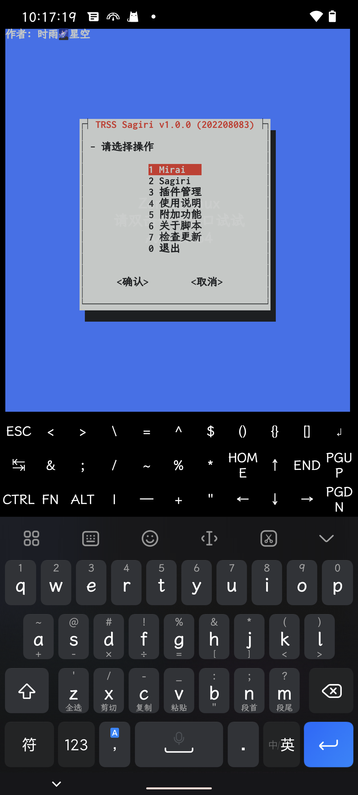
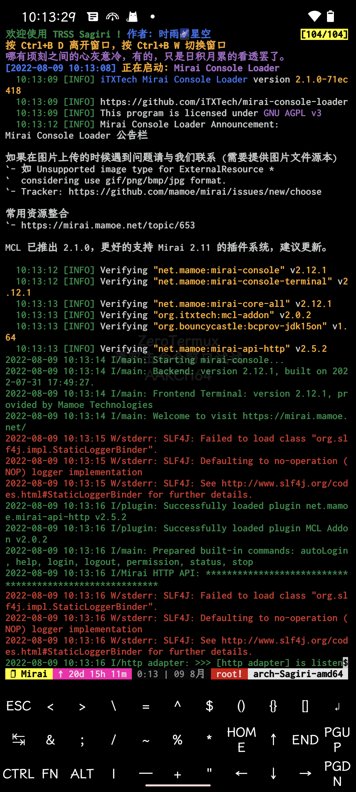
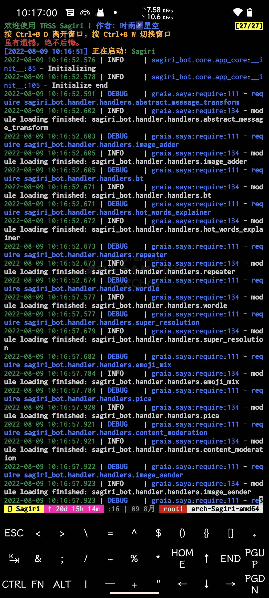

<div align="center">

[](https://moegirl.org.cn/亚托莉)

# TRSS Sagiri
纱雾机器人管理脚本

[](https://github.com/TimeRainStarSky/TRSS_Sagiri/stargazers)
[](https://gitee.com/TimeRainStarSky/TRSS_Sagiri/raw/main/Install.sh)
[](https://github.com/TimeRainStarSky/TRSS_Sagiri/releases/latest)

[](https://github.com/TimeRainStarSky/TRSS_Sagiri)

</div>

## 使用教程
1. 准备：[Arch Linux](https://archlinux.org)
- [Windows](https://www.microsoft.com/windows) 推荐使用 [ArchWSL](https://github.com/yuk7/ArchWSL) [详细教程](https://bytem.io/posts/install-arch-wsl)
- [Termux](https://github.com/hanxinhao000/ZeroTermux) 或`其他 Linux 发行版`推荐使用 [TMOE](https://gitee.com/mo2/linux) 安装 [Arch Linux](https://archlinux.org) 容器
- [详细教程 Guide/TMOE.md](Guide/TMOE.md)

2. 安装：
```
curl -LO "https://gitee.com/TimeRainStarSky/TRSS_Sagiri/raw/main/Install.sh" && bash Install.sh
```

3. 启动：`tssi`

视频教程：<https://bilibili.com/av983453309>

## 使用说明
- [Sagiri](https://sagiri-kawaii.github.io/sagiri-bot) <-HTTP连接-> [Mirai](https://docs.mirai.mamoe.net) <-网络连接-> [QQ服务器](https://im.qq.com)
- [Mirai](https://docs.mirai.mamoe.net)：提供QQ账号管理，收发消息等功能
- [Sagiri](https://sagiri-kawaii.github.io/sagiri-bot)：对消息进行处理，完成目标操作

## 常见问题
- 问：发消息错误：46
- 答：账号被风控

- 问：address already in use
- 答：端口被占用，请尝试停止占用进程、重启设备，或修改配置文件，更改端口

- 问：open terminal failed: not a terminal
- 答：TMOE proot 容器首次启动会出现，重启容器就行了

- 问：[server exited unexpectedly]
- 答：tmux 进程意外退出，可能是系统资源不足引起的，如果在 Termux 中经常出现，请检查设置：电池优化、后台运行权限

- 问：我有其他问题
- 答：提供详细问题描述，通过下方 联系方式 反馈问题

## 联系方式
- QQ群组：[211414032](https://jq.qq.com/?k=QU1xGLEB)
### 时雨🌌星空
- GitHub：[TimeRainStarSky](https://github.com/TimeRainStarSky)
- 酷安：[时雨丶星空](http://www.coolapk.com/u/2650948)
- QQ：[2536554304](https://qm.qq.com/cgi-bin/qm/qr?k=x8LtlP8vwZs7qLwmsbCsyLoAHy7Et1Pj)
- Telegram：[TimeRainStarSky](https://t.me/TimeRainStarSky)

## 界面展示
[](https://github.com/TimeRainStarSky/TRSS_Sagiri)
[](https://github.com/iTXTech/mirai-console-loader)
[](https://sagiri-kawaii.github.io/sagiri-bot)

## 相关项目
[](https://github.com/TimeRainStarSky/TRSS_Liteyuki)
[](https://github.com/TimeRainStarSky/TRSS_Yunzai)
[](https://github.com/TimeRainStarSky/TRSS_Sagiri)
[](https://github.com/TimeRainStarSky/TRSS_OneBot)

## 赞助支持
- 爱发电：<https://afdian.net/@TimeRainStarSky>
- Partme：<https://partme.com/TimeRainStarSky>